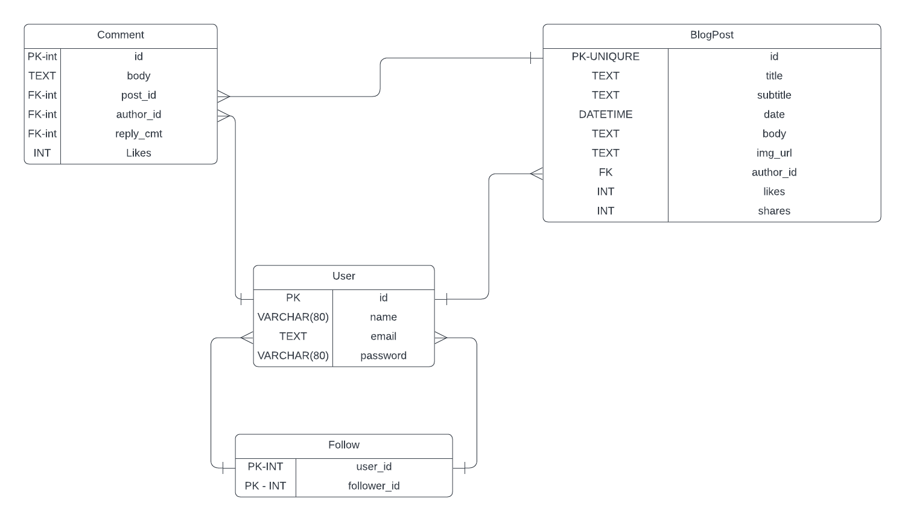

# Technology Blog Website.

## Thành viên

| MÃ SINH VIÊN | HỌ TÊN |
| ------------ | ------ |
| 22022565 | Nguyễn Công Huynh |
| 22022570 | Lèng Hữu Phúc |
| 22022571 | Nguyễn Văn Trường |
|22022652 | Ngô Đức Hùng |


## Running this project

```
pip install -r requirements.txt 
```

```
python main.py
```

## Các chức năng

### 1. Giao diện người dùng (UI/UX) Thuận tiện:

- Thiết kế giao diện đẹp, dễ sử dụng và thân thiện với người dùng.

- Tích hợp hình ảnh và video.

### 2. Tìm kiếm và Khám phá bài viết:

- Tích hợp công cụ tìm kiếm, tìm kiếm theo từ khoá, bài viết.

- Hiển thị bài viết phổ biến, mới nhất, liên quan.

### 3. Quản lý nội dung dễ dàng:

- Giao diện quản trị đơn giản, cho phép biên tập, sử đổi và quản lý bài viết, quản lý kênh.

- Hỗ trợ định dạng văn bản, hình ảnh, video.

### 4. Tích hợp hệ thống bình luận:

- Cho phép chia sẻ ý kiến, bình luận.

- Ngăn chặn spam và bảo vệ chất lượng nội dung.

### 5. Tính năng theo dõi và đăng kí bản tin:

- Nhận thông báo về bài viết mới qua email.

- Tính năng theo dõi, luôn gợi ý trên newfeed.

### 6. Tích hợp hệ thống Tags và Danh mục:

- Hỗ trợ tạo và quản lý các tags và danh mục để phân loại bài viết một cách rõ ràng và dễ dàng tìm kiếm.

- Hiển thị các tags và danh mục liên quản để người đọc có thể khám phá nội dung tương tự.


## Database:


